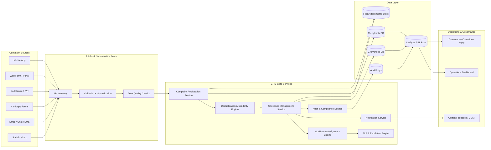
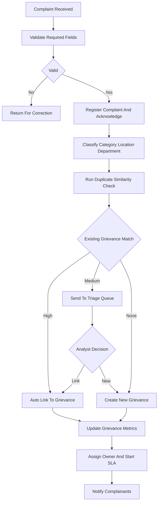
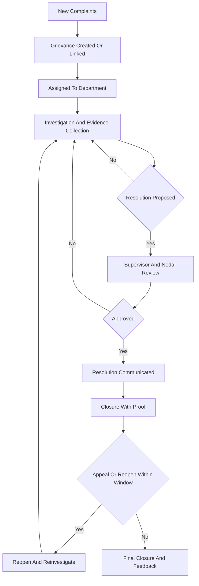
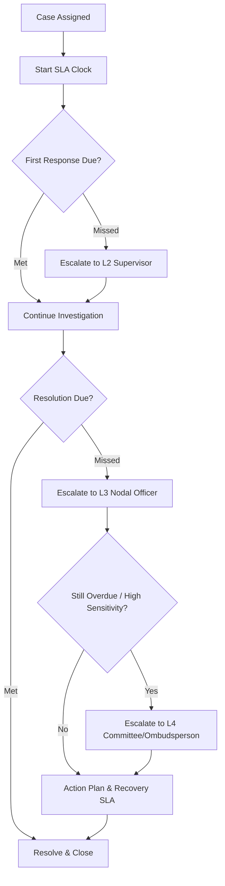
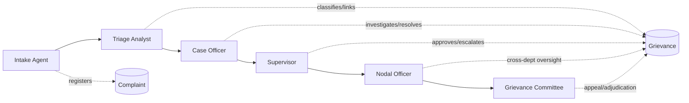
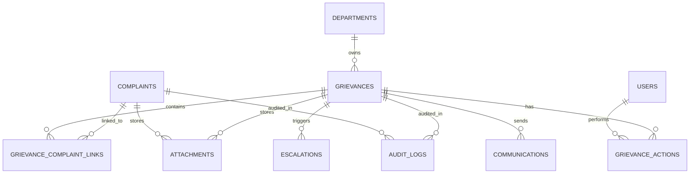
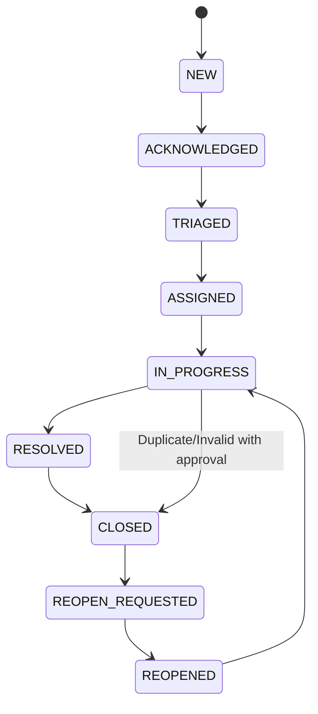
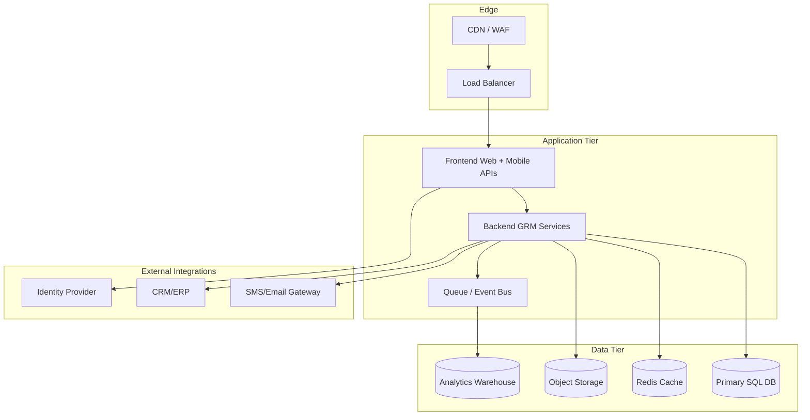
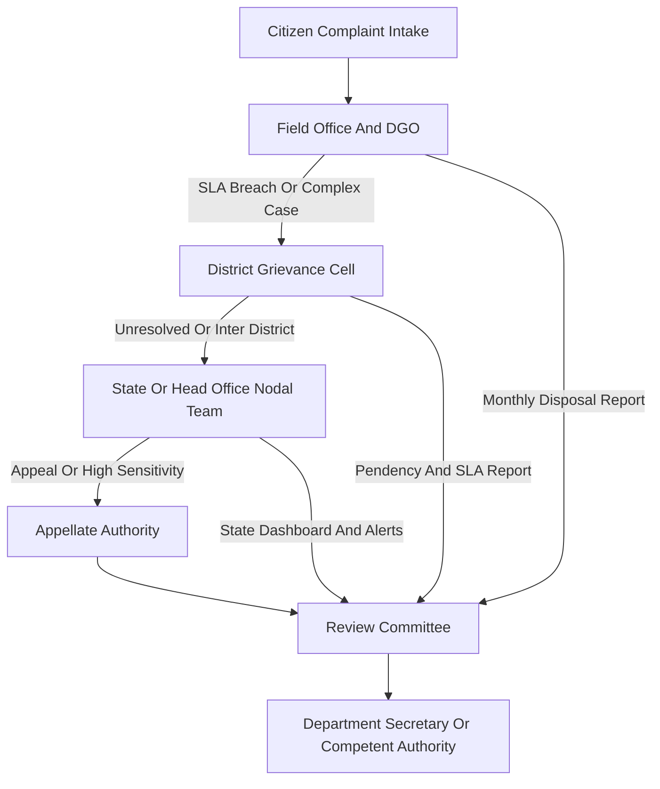

# Grievance Redressal Mechanism (GRM) — Architecture & Flow Diagrams

This document provides technical architecture and process flow diagrams for the GRM platform.

## 1) High-Level System Architecture

## 2) Complaint to Grievance Consolidation Flow

## 3) End-to-End Grievance Redressal Workflow

## 4) SLA Monitoring and Escalation Flow

## 5) Role-Based Responsibility Flow (RACI Style)

## 6) Logical Data Model (Entity Relationship)

## 7) Status Lifecycle State Diagram

## 8) Deployment View (Reference)

## 9) Notes for Implementation

- Use these Mermaid blocks directly in Markdown-compatible viewers (GitHub, GitLab, many docs portals).
- If your platform does not support Mermaid natively, export diagrams to SVG/PNG during CI and embed images.
- Keep diagram labels aligned with your actual module/service names to avoid drift.

## 10) Government Governance and Escalation View

